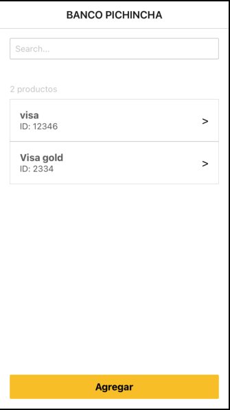
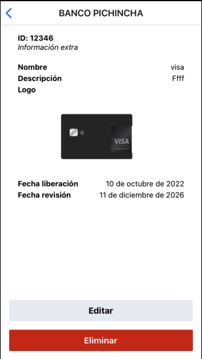
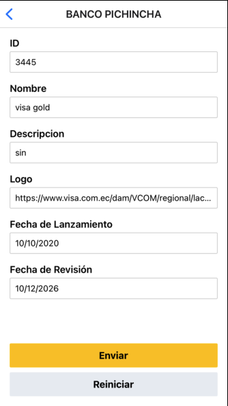
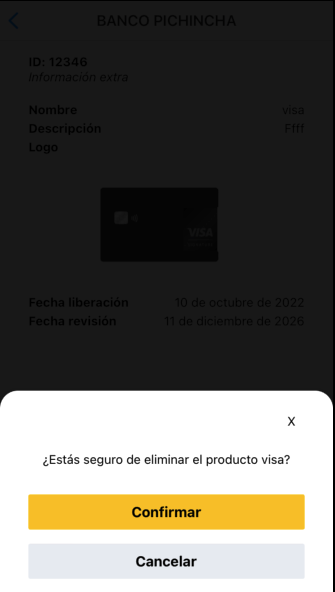

# FinTrackApp

# Getting Started

> **Note**: Make sure you have completed the [React Native - Environment Setup](https://reactnative.dev/docs/environment-setup) instructions till "Creating a new application" step, before proceeding.

## Description

FinTrackApp is a React Native application designed for managing financial products. This app enables viewing, searching, adding, editing, and deleting financial products, meeting the specific requirements of Banco Pichincha.

## Technologies and Tools

-   React Native 0.7+
-   React 18+
-   TypeScript 4.8+
-   Jest for Unit Testing

## Installation and Setup

Clone the repository using `git clone https://github.com/OscarDRT/FinTrackApp` and run `yarn install` to install all necessary dependencies.

```
git clone https://github.com/OscarDRT/FinTrackApp
cd FinTrackApp
yarn install
```

## Running the Project

To start the project, run `yarn start`. This will start the Metro server, and you can run the app on an emulator or physical device.

If everything is set up _correctly_, you should see your new app running in your _Android Emulator_ or _iOS Simulator_ shortly provided you have set up your emulator/simulator correctly.

This is one way to run your app — you can also run it directly from within Android Studio and Xcode respectively.

## Unit Testing

Run `yarn test` to execute the unit tests.

## Project Structure

The core codebase of `FinTrackApp` is contained within the `src/` directory, organized as follows for efficient development and maintenance:

```
src/
│
├── @types/              # TypeScript type declarations
├── components/          # Reusable components
├── hooks/               # Custom React hooks
├── navigation/          # React Navigation setup and configuration
├── screens/             # Application screens
├── services/            # Services for handling backend logic
└── utils/               # Utility functions
```

Each subdirectory serves a specific purpose, ensuring a modular and organized approach to app development.

## Implemented Features

### F1. Listing of Financial Products

Displays a list of financial products.




### F2. Searching for Financial Products

Enables the search for financial products using a text field.


### F3. Number of Records

Shows a list of obtained records.


### F4. Add Product

Form to add new financial products.




### F5. Edit Product

Functionality to edit an existing product.


### F6. Delete Product

Allows the deletion of a product through a modal.




## Contribution

Contributions are welcome. Please read the contribution guidelines on how to do so.

## Authors and Contact

-   Oscar Riaño Tapias
-   Contact: oscardrtdev@gmail.com
-   [LinkedIn](https://www.linkedin.com/in/oscardrt/)
